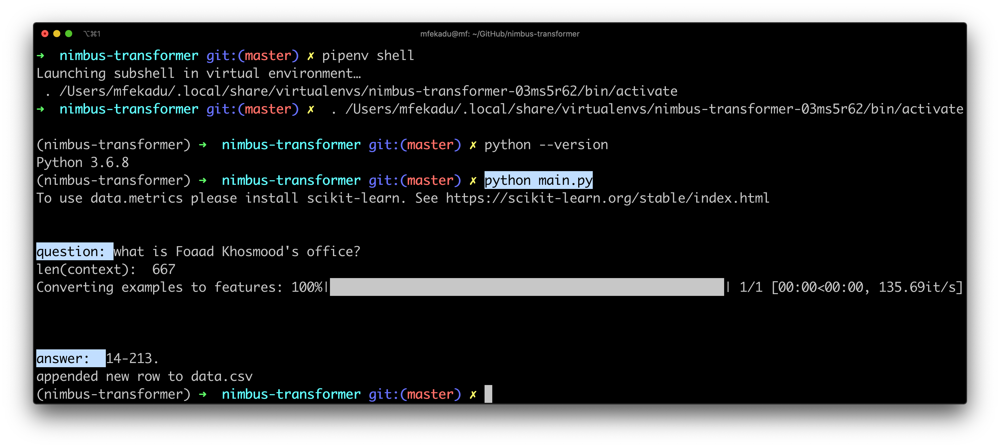
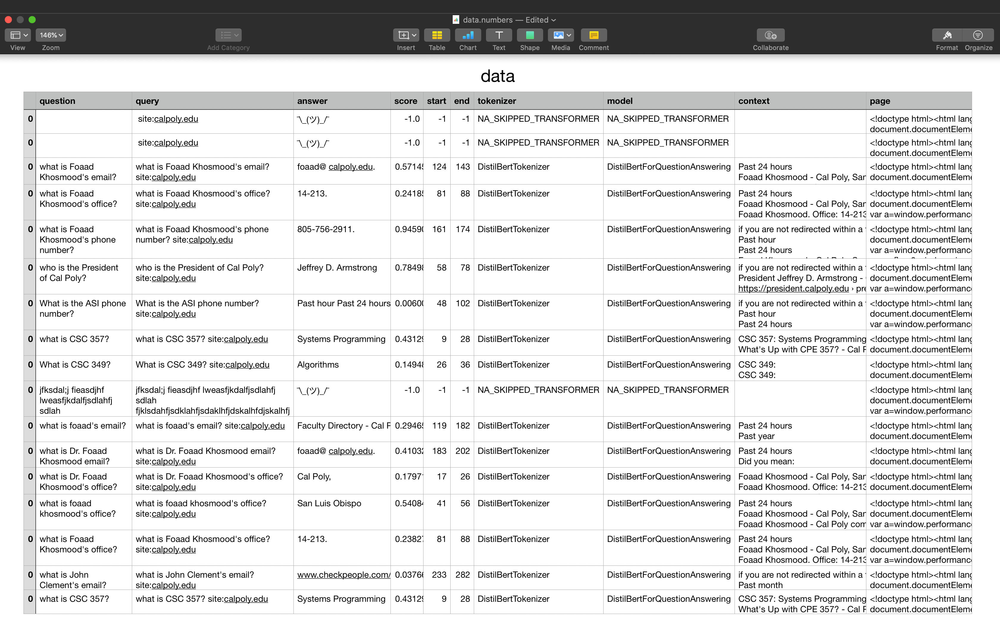

# nimbus-transformer

it's like [Nimbus][14] but uses a [transformer language model][2]

Written in a Functional Programming style.

## [Documentation][10]

## Getting Started

### 1. [Install Pipenv][11]

Works with macOS, Linux, [Windows][13].

### 2. Setup virtual environment

```bash
pipenv install
```

This will create a virtual environment with the required:

- [Python 3.6.8][12]
- all the `[packages]` listed in the [`Pipfile`](./Pipfile)

### 3. Open virtual environment

```bash
pipenv shell
```

### 4. Verify your python version

```bash
$ python --version
Python 3.6.8
```

## Usage

```python
from ntfp.ntfp import get_context, transformer
question = "what is Dr. Foaad Khosmood email?"
_, _, context = get_context(question)
answer, _ = transformer(question, context)
print("answer: ", answer)
>>> answer:  foaad@ calpoly.edu.
```

## Demo

```
$ python main.py
To use data.metrics please install scikit-learn. See https://scikit-learn.org/stable/index.html


question: what is Dr. Foaad Khosmood email?
len(context):  911
Converting examples to features: 100%|██| 1/1 [00:00<00:00, 95.61it/s]


answer:  foaad@ calpoly.edu.
appended new row to data.csv
```



## How it works

**Assumptions**

- "Context" is limited to Cal Poly, so expect non-Cal-Poly "Questions" to fail
- "Answer" is expected to exist publically on the web, such that Google can access it.

**Pipeline**

1. _User_ asks [`Question`] to a web application.
2. Scrape Google for [`Context`] limit 10 url results.
3. Store [`Context`] into database.
4. [Transform] ( [`Question`], [`Context`] ) >> [`Answer`]
5. Reply with [`Answer`]
6. Mark, good/bad answer _to learn from later_.

## TODO

- [ ] a simple web UI with an input box and a section for answers
  - if bad-answer then offer user a toggle: isItAnyOf(ans1,ans2..)
  - if user does not choose a toggle then mark as _possibly-answerable_
  - set up a nice UI for verification team to complete task.
- [ ] database code for
  - INSERT [`Context`]/[`Question`]/[`Answer`]/_timestamp_/_good-bad-answer_
  - UPDATE _good-bad-anxswer_
- [ ] test performance
  - avoid test generation by code because the test itself should not depend on subject-under-test.
  - measure **`precision` & `recall`** of this system
- [ ] make improvements to _assumptions_
- [ ] consider `git rev-parse HEAD` to get latest commit hash to associate with data.
- [ ] consider learning new facts from `TrustedUser`
  - e.g. Dr. Khosmood is a `TrustedUser` and can offer the system either:
    - [`URL`]
      - _e.g. a published google doc containing a professor's syllabus._
      - _e.g. a professor's personal website_
    - [`UserContext`]
      - _e.g. the plain-text of a professor's syllabus._
      - **either** provided through real-time chat client
      - **or** provided through a simple input box
      - **also** consider `ChatContext`
    - ([`Question`], [`Answer`]) mappings
    - **so**, when any `User` asks a previously mapped question, then the correct answer can be returned
    - **or**, when the most relevant [`UserContext`] is found for the given question, a reasonable answer can still be returned.
- [ ] question/answer data augmentation
  - _remember augmentations need grammar check by human_
  - [try Question-Paraphrasing][15]
  - also try [style-transformations][16]
    - "PHRASE REPLACEMENT TRANSFORM" ([Khosmood], pg. 118)
      - `I wanted to be with you alone`
        - => `I desired to be with you only.`
      - class `phraseXform`
        - update it to latest technologies: SpaCy! BabelNet?
      - similar to [/r/IncreasinglyVerbose][17]
      - `I teach at Cal Poly`
        - => `I teach at a university in California`
          - (replace **Stanford University** with definition)
        - => `I impart skills or knowledge to students at a university in California`
          - (replace **teach** with definition and append _students_)
        - => `I impart skills or knowledge to students at an establishment where a seat of higher learning is housed in California`
          - (replace **university** with definition)
        - => `I impart skills or knowledge to students at an establishment where a seat of higher learning is housed in San Luis Obispo, California`
          - (apply knowledge of city location of Cal Poly)
      - "Translation-Tours" ([Khosmood], pg. 141)
        - "Translation tour with Spanish, French, German" ([Khosmood], pg. 141)
          - `I teach at Cal Poly`
            - => `Enseño en Cal Poly` (Enlish => Spanish)
            - => `J'enseigne à Cal Poly` (Spanish => French)
            - => `Ich unterrichte an der Cal Poly` (French => German)
            - => `I teach at Cal Poly` (German => English)
          - `I teach at Cal Poly.`
            - => `Doy clases en Cal Poly.` (Enlish => Spanish)
            - => `Ich unterrichte an der Cal Poly.`
            - => `I teach at Cal Poly.`
        - Alternative Translation Tours
          - `I teach at Cal Poly`
            - => `እኔ በካሊ ፖሊ አስተምራለሁ ፡፡` (English => Amharic)
            - => `I teach by Kali Poly.` (Amharic => English)

## What is `data.csv`?

`data.csv` is a temporary "database" for appending question samples with the generated meta-data and final answer of this system.

Keeping track of this data will help with measuring the model's performance and making improvements based on performance metrics.



## Resources

- [**huggingface/transformers**][2]
- [**explosion/spaCy**][3]
- **Technical Talk:** [Using spaCy with Bert | Hugging Face Transformers | Matthew Honnibal][1]
- [example google search][4]
- [`pip install google` source code][7]
- [`pip install google` tutorial][5]
  - read this in more depth for alternative google search api options
- [`pip install google` geeksforgeeks][6]
- [`pip install beautifulsoup4`][8]

[1]: https://www.youtube.com/watch?v=RB9uDpJPZdc
[2]: https://github.com/huggingface/transformers
[3]: https://github.com/explosion/spaCy
[4]: http://google.com/search?q=what+is+foaad+email?+site:calpoly.edu
[5]: https://towardsdatascience.com/current-google-search-packages-using-python-3-7-a-simple-tutorial-3606e459e0d4
[6]: https://www.geeksforgeeks.org/performing-google-search-using-python-code/
[7]: https://github.com/MarioVilas/googlesearch
[8]: https://pypi.org/project/beautifulsoup4/
[9]: https://github.com/huggingface/transformers#quick-tour-of-pipelines
[10]: https://mfekadu.github.io/nimbus-transformer/
[11]: https://pipenv.pypa.io/en/latest/install/#installing-pipenv
[12]: http://python.org
[13]: https://pipenv.pypa.io/en/latest/install/#pragmatic-installation-of-pipenv
[14]: http://github.com/calpoly-csai/api
[15]: https://www.aclweb.org/anthology/P19-1610/
[16]: https://works.bepress.com/foaad/2/
[khosmood]: https://works.bepress.com/foaad/2/
[17]: https://www.reddit.com/r/IncreasinglyVerbose/
[`question`]: https://mfekadu.github.io/nimbus-transformer/ntfp_types.html#ntfp.ntfp_types.Question
[`context`]: https://mfekadu.github.io/nimbus-transformer/ntfp_types.html#ntfp.ntfp_types.Context
[`answer`]: https://mfekadu.github.io/nimbus-transformer/ntfp_types.html#ntfp.ntfp_types.Answer
[transform]: https://mfekadu.github.io/nimbus-transformer/ntfp.html#ntfp.ntfp.transformer
[`url`]: https://mfekadu.github.io/nimbus-transformer/ntfp_types.html#ntfp.ntfp_types.URL
[`usercontext`]: https://mfekadu.github.io/nimbus-transformer/ntfp_types.html#ntfp.ntfp_types.UserContext
